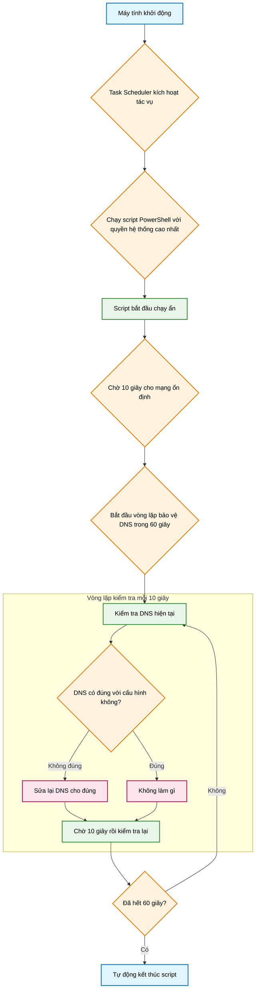
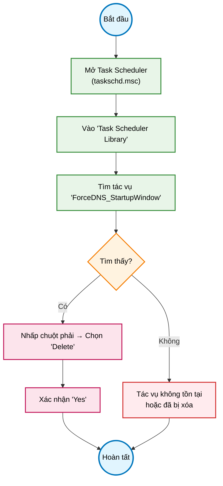

### Hướng dẫn Toàn tập: Tự động giữ DNS cố định khi khởi động bằng PowerShell và Task Scheduler

Bài hướng dẫn này sẽ chỉ cho bạn cách sử dụng một script PowerShell để tự động đảm bảo máy tính luôn nhận đúng địa chỉ DNS bạn muốn (ví dụ: Google DNS `8.8.8.8`) trong một phút đầu tiên sau khi khởi động. Việc này rất hữu ích để chống lại các thay đổi DNS không mong muốn từ phần mềm khác hoặc nhà mạng.

Chúng ta sẽ đi qua 2 phần chính:
1.  **Cài đặt tác vụ:** Bao gồm phương pháp tự động (khuyến nghị) và phương pháp thủ công để bạn hiểu sâu hơn.
2.  **Gỡ bỏ tác vụ:** Hướng dẫn chi tiết cách xóa tác vụ bằng giao diện đồ họa khi không cần dùng nữa.

#### Tổng quan quy trình hoạt động

Trước khi bắt đầu, hãy xem sơ đồ dưới đây để hình dung script sẽ làm gì sau khi được cài đặt.

*Sơ đồ 1: Luồng hoạt động của tác vụ sau khi máy tính khởi động.*



---

### Phần 1: Cài đặt tác vụ

Bạn có thể chọn một trong hai phương pháp dưới đây. Phương pháp tự động nhanh và chính xác nhất.

#### Phương pháp 1: Tự động (Khuyến nghị)

Script gốc đã được thiết kế để tự làm mọi việc. Bạn chỉ cần chạy nó một lần duy nhất.

1.  Mở **Windows PowerShell** với quyền quản trị viên (Run as Administrator).
    *   Nhấn phím `Windows`, gõ `PowerShell`, nhấp chuột phải vào kết quả và chọn `Run as administrator`.
2.  Sao chép (copy) toàn bộ khối mã dưới đây, dán (paste) vào cửa sổ PowerShell rồi nhấn `Enter`.

```powershell
# === SOFT-GUARD DNS: chỉ giữ 1 phút sau khi boot, sửa khi lệch, rồi thoát ===
# ---- CONFIG ----
$Servers              = @('8.8.8.8','8.8.4.4')   # đổi tuỳ ý (Cloudflare: @('1.1.1.1','1.0.0.1'))
$InitialDelaySeconds  = 10                        # chờ một chút cho mạng lên
$WindowSeconds        = 60                        # bảo vệ trong 1 phút đầu sau khi boot
$IntervalSeconds      = 10                        # kiểm tra mỗi 10s trong cửa sổ 1 phút
$TaskName             = 'ForceDNS_StartupWindow'

# ---- Lệnh sẽ chạy lúc boot (nhẹ, chỉ sửa khi lệch) ----
$serversLiteral = ($Servers | ForEach-Object { "'$_'" }) -join ','
$template = @'
$ErrorActionPreference='SilentlyContinue';
Start-Sleep -Seconds __INIT__;
$desired=@(__SERVERS__);
$deadline = (Get-Date).AddSeconds(__WIN__);
$interval = __INT__;
$changed  = $false

do {
  # Chỉ xử lý adapter đang Up (Wi-Fi/Ethernet/VPN/VM ... đang hoạt động)
  $up = Get-NetAdapter -EA SilentlyContinue | Where-Object { $_.Status -eq 'Up' }
  if ($up) {
    $clients = Get-DnsClient -AddressFamily IPv4 -EA SilentlyContinue | Where-Object {
      $up.InterfaceAlias -contains $_.InterfaceAlias
    }

    foreach ($c in $clients) {
      try {
        $cur = (Get-DnsClientServerAddress -InterfaceAlias $c.InterfaceAlias -AddressFamily IPv4 -EA SilentlyContinue).ServerAddresses
        if (-not $cur -or ($cur -join ',') -ne ($desired -join ',')) {
          # Thử cmdlet hiện đại trước
          try { Set-DnsClientServerAddress -InterfaceIndex $c.InterfaceIndex -ServerAddresses $desired -EA Stop }
          catch {
            # Nếu vẫn lệch, fallback netsh (chỉ cho alias đó)
            & netsh interface ipv4 set dns name="$($c.InterfaceAlias)" static $desired[0] primary | Out-Null
            for ($i=1; $i -lt $desired.Count; $i++) {
              & netsh interface ipv4 add dns name="$($c.InterfaceAlias)" address=$desired[$i] index=$($i+1) | Out-Null
            }
          }
          $changed = $true
        }
      } catch {}
    }
    if ($changed) { ipconfig /flushdns | Out-Null; $changed = $false }
  }

  if ((Get-Date) -ge $deadline) { break }
  Start-Sleep -Seconds $interval
} while ($true)
'@

$cmd = $template.
  Replace('__INIT__',[string]$InitialDelaySeconds).
  Replace('__WIN__',[string]$WindowSeconds).
  Replace('__INT__',[string]$IntervalSeconds).
  Replace('__SERVERS__',$serversLiteral)

# ---- Gỡ task cũ (nếu có) & đăng ký lại (AtStartup duy nhất) ----
try { Unregister-ScheduledTask -TaskName $TaskName -Confirm:$false -EA SilentlyContinue } catch {}
$action    = New-ScheduledTaskAction -Execute 'powershell.exe' -Argument "-NoProfile -ExecutionPolicy Bypass -WindowStyle Hidden -Command `"$cmd`""
$trigger   = New-ScheduledTaskTrigger -AtStartup               # không dùng -Delay để tương thích 5.1; delay nằm trong $cmd
$principal = New-ScheduledTaskPrincipal -UserId 'SYSTEM' -RunLevel Highest
$settings  = New-ScheduledTaskSettingsSet -StartWhenAvailable -ExecutionTimeLimit (New-TimeSpan -Minutes 5)
Register-ScheduledTask -TaskName $TaskName -Action $action -Trigger $trigger -Principal $principal -Settings $settings -Force | Out-Null

# ---- Áp dụng ngay lần đầu (khỏi chờ reboot) ----
powershell -NoProfile -ExecutionPolicy Bypass -Command $cmd

Write-Host "`nĐÃ cấu hình: DNS -> $($Servers -join ', ') | Task: $TaskName (AtStartup, bảo vệ $WindowSeconds s, kiểm tra mỗi $IntervalSeconds s)." -ForegroundColor Green
Get-ScheduledTask -TaskName $TaskName | Select-Object TaskName,State,LastRunTime
Get-DnsClientServerAddress -AddressFamily IPv4 | Select-Object InterfaceAlias,ServerAddresses
```

**Xong!** Script sẽ tự động tạo tác vụ `ForceDNS_StartupWindow` trong Task Scheduler và áp dụng DNS ngay lập tức.

---

#### Phương pháp 2: Thủ công (Để hiểu rõ quy trình)

Phương pháp này chia làm 2 bước: tạo file script và cấu hình Task Scheduler bằng tay.

##### Bước 1: Tạo file Script (.ps1)

1.  Mở trình soạn thảo văn bản như **Notepad**.
2.  Sao chép **chỉ phần mã logic** dưới đây và dán vào Notepad.
    ```powershell
    # Script này sẽ được Task Scheduler gọi
    $ErrorActionPreference='SilentlyContinue';

    # ---- Cấu hình cứng ----
    $desired = @('8.8.8.8','8.8.4.4'); # DNS mong muốn
    $InitialDelaySeconds = 10;
    $WindowSeconds = 60;
    $IntervalSeconds = 10;
    # -------------------------

    Start-Sleep -Seconds $InitialDelaySeconds;
    $deadline = (Get-Date).AddSeconds($WindowSeconds);
    $changed = $false;

    do {
      $up = Get-NetAdapter -EA SilentlyContinue | Where-Object { $_.Status -eq 'Up' }
      if ($up) {
        $clients = Get-DnsClient -AddressFamily IPv4 -EA SilentlyContinue | Where-Object { $up.InterfaceAlias -contains $_.InterfaceAlias }
        foreach ($c in $clients) {
          try {
            $cur = (Get-DnsClientServerAddress -InterfaceAlias $c.InterfaceAlias -AddressFamily IPv4 -EA SilentlyContinue).ServerAddresses
            if (-not $cur -or ($cur -join ',') -ne ($desired -join ',')) {
              try { Set-DnsClientServerAddress -InterfaceIndex $c.InterfaceIndex -ServerAddresses $desired -EA Stop }
              catch {
                & netsh interface ipv4 set dns name="$($c.InterfaceAlias)" static $desired[0] primary | Out-Null
                for ($i=1; $i -lt $desired.Count; $i++) { & netsh interface ipv4 add dns name="$($c.InterfaceAlias)" address=$desired[$i] index=$($i+1) | Out-Null }
              }
              $changed = $true
            }
          } catch {}
        }
        if ($changed) { ipconfig /flushdns | Out-Null; $changed = $false }
      }
      if ((Get-Date) -ge $deadline) { break }
      Start-Sleep -Seconds $IntervalSeconds
    } while ($true)
    ```
3.  Lưu file lại:
    *   Chọn `File` -> `Save As...`.
    *   **Save as type:** Chọn `All Files (*.*)`.
    *   **File name:** Đặt tên là `ForceDNS.ps1` và lưu ở một vị trí cố định, ví dụ: `C:\Scripts\ForceDNS.ps1`.

##### Bước 2: Cấu hình Task Scheduler

*Sơ đồ 2: Quy trình các bước cấu hình Task Scheduler thủ công.*


1.  Mở **Task Scheduler** (gõ `taskschd.msc` vào hộp thoại Run `Win + R`).
2.  Ở khung bên phải, chọn `Create Task...`.
3.  **Tab General:**
    *   **Name:** `ForceDNS_StartupWindow`.
    *   Tích vào ô **`Run with highest privileges`**.
    *   Nhấn `Change User or Group...`, gõ `SYSTEM`, nhấn `OK`.
    *   Chọn **`Run whether user is logged on or not`**.
4.  **Tab Triggers:**
    *   Nhấn `New...`.
    *   Ở mục `Begin the task`, chọn **`At startup`**.
    *   Nhấn `OK`.
5.  **Tab Actions:**
    *   Nhấn `New...`.
    *   **Action:** `Start a program`.
    *   **Program/script:** Gõ `powershell.exe`.
    *   **Add arguments (optional):** Dán vào dòng sau (nhớ thay đổi đường dẫn nếu bạn lưu file ở nơi khác):
      `-NoProfile -ExecutionPolicy Bypass -File "C:\Scripts\ForceDNS.ps1"`
    *   Nhấn `OK`.
6.  Nhấn `OK` một lần nữa để lưu lại tác vụ.

Vậy là bạn đã hoàn tất việc cài đặt thủ công.

---

### Phần 2: Gỡ bỏ tác vụ (Khi không cần nữa)

Khi bạn muốn gỡ bỏ chức năng này, cách đơn giản nhất là xóa tác vụ đã tạo trong Task Scheduler.

#### Hướng dẫn Gỡ bỏ Thủ công qua Task Scheduler


*Sơ đồ 3: Quy trình gỡ bỏ tác vụ thủ công.*

1.  **Mở Task Scheduler:** Nhấn `Windows + R`, gõ `taskschd.msc` và nhấn `Enter`.
2.  **Tìm thư viện:** Ở khung bên trái, nhấp vào `Task Scheduler Library`.
3.  **Xác định tác vụ:** Trong danh sách ở giữa, tìm đến tác vụ có tên `ForceDNS_StartupWindow`. Bạn có thể nhấp vào cột `Name` để sắp xếp theo alphabet.
4.  **Xóa tác vụ:**
    *   Nhấp chuột phải vào tác vụ `ForceDNS_StartupWindow`.
    *   Chọn **`Delete`** từ menu hiện ra.
5.  **Xác nhận:** Một hộp thoại sẽ hỏi bạn có chắc chắn muốn xóa không. Chọn **`Yes`**.

Tác vụ sẽ biến mất khỏi danh sách. Từ lần khởi động máy tiếp theo, script sẽ không còn chạy nữa và DNS của bạn sẽ hoạt động như bình thường.
